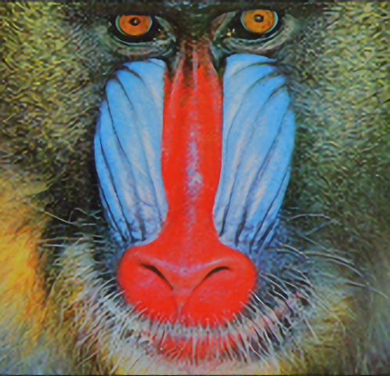

# VDSR in Tensorflow

Tensorflow implementation of **Accurate Image Super-Resolution Using Very Deep Convolutional Networks**.

*GT* | *Bicubic* | *SRCNN* | *VDSR*
:---: | :---: | :---: | :---: |
 |  |  | 

## Implementation Details

### Network Architecture

| *Layer*      | *# of layers* |   *Filter size* | *Input, output channel* | *Activation Function* |
| :----------: | :-----------: | :-------------: | :---------------------: | :-------------------: |
| Input Layer  | 1             | 3 x 3           | (1, 64)                 | ReLU                  |
| Hidden Layer | 18            | 3 x 3           | (64, 64)                | ReLU                  |
| Output Layer | 1             | 3 x 3           | (64, 1)                 | -                     |

### Implementation Detail

#### Loss function

- Mean Squared Error loss (Euclidean loss)
- Residual learning 

#### Regularization

- Different from original paper, no regularization is used 

#### Optimization

- Weight initialization: He method
- Bias initialization: Zero initialize
- AdamOptimizer
    - Learning rate: 0.0001
    - Epoch: 60
    - Batch size: 128
    - Iteration per epoch: 6418
    - No learning rate decaying, gradient clipping are used

### Training Dataset

- 291 images dataset with data augmentation (rotate or flip) is used
- Data augmentation
    - Downsize with (1.0, 0.9) scales
    - Rotate (0, 90, 180, 270) degrees
    - Flip left-right
- More than 700,000 patch pairs are generated (up to 20GB)

## Installation

```bash
git clone https://github.com/jinsuyoo/VDSR-Tensorflow.git
```

## Requirements

You will need the following to run the above:
- Tensorflow-gpu
- Python3, Numpy, Pillow, h5py, tqdm

To install quickly, use `requirements.txt`. Example usage:
```bash
pip install -r requirements.txt
```
Note that we run the code with Ubuntu 16.04 LTS, Tensorflow-gpu 1.13.1, CUDA 10.0, cuDNN v7.6.0 

## Documentation

To pre-process the train and test dataset, you need to execute the Matlab code.

Generating training data takes about half an hour, up to 20GB.

Pre-processed test data with Set5 and Set14 is provided.

### Training VDSR
Use `main.py` to train the network. Run `python main.py` to view the training process. Training takes about 12 hours on a NVIDIA GeForce RTX 2080. Example usage:
```bash
# Quick training
python main.py

# Example usage
python main.py --epoch 40 --layer_depth 10 --learning-rate 1e-3 --checkpoint-path checkpoint/YOUR_CHECKPOINT_PATH

# Usage
python main.py [-h] [--epoch EPOCH] [--batch-size BATCH_SIZE] 
               [--layer-depth LAYER_DEPTH] [--learning-rate LEARNING_RATE] [--train-dataset TRAIN_DATASET] [--valid-dataset VALID_DATASET] [--checkpoint-path CHECKPOINT_PATH]
               
optional arguments:
  -h, --help                Show this help message and exit
  --epoch                   Number of epoch for training (Default: 60)
  --batch-size              Batch size for training (Default: 128)
  --layer-depth             Depth of the network layer (Default: 20)
  --learning-rate           Learning rate for training (Default: 1e-4)

```

### Testing VDSR
Also use `main.py` to test the network. Pretrained-model (multi-scale) with 291-image training dataset is given. Example usage:
```bash
# Quick testing
python main.py --test

# Example usage
python main.py --test \
    --model-path checkpoint/VDSR \
    --test-dataset Urban100 \
    --scale 4
```
  
Note that if you want to train or test with your own dataset, you need to execute the Matlab code with your own dataset first :)

## Results

### The average results of PSNR (dB) value

*Dataset*    | *Scale* | *Bicubic* | *VDSR*  | *VDSR-Tensorflow* 
:----------: | :-----: | :-------: | :-----: | :---------------: 
**Set5**     | x2      | 33.66dB   | 37.53dB | 37.46dB
**Set5**     | x3      | 30.39dB   | 33.66dB | 33.64dB
**Set5**     | x4      | 28.42dB   | 31.35dB | 31.09dB
**Set14**    | x2      | 30.24dB   | 33.03dB | 33.09dB
**Set14**    | x3      | 27.55dB   | 29.77dB | 29.87dB
**Set14**    | x4      | 26.00dB   | 28.01dB | 27.97dB
**BSD100**   | x2      | 29.56dB   | 31.90dB |
**BSD100**   | x3      | 27.21dB   | 28.82dB |
**BSD100**   | x4      | 25.96dB   | 27.29dB |
**Urban100** | x2      | 26.88dB   | 30.76dB |
**Urban100** | x3      | 24.46dB   | 27.14dB |
**Urban100** | x4      | 23.14dB   | 25.18dB |


### Some of the result images

*GT* | *Bicubic* | *VDSR* 
:---: | :---: | :---: |
 |  |  
 |  |  
 |  |  
 |  |  


## References

- [Official Website][1]
    - We referred to the original Matlab and Caffe code.

- [jinsuyoo/SRCNN-Tensorflow][2]
    - Our implementation of SRCNN.
 
[data]: https://drive.google.com/file/d/1yvQYDYKCrTNxtvkOAHpTFOapEDyji0RR/view?usp=sharing
[1]: https://cv.snu.ac.kr/research/VDSR/
[2]: https://github.com/jinsuyoo/SRCNN-Tensorflow